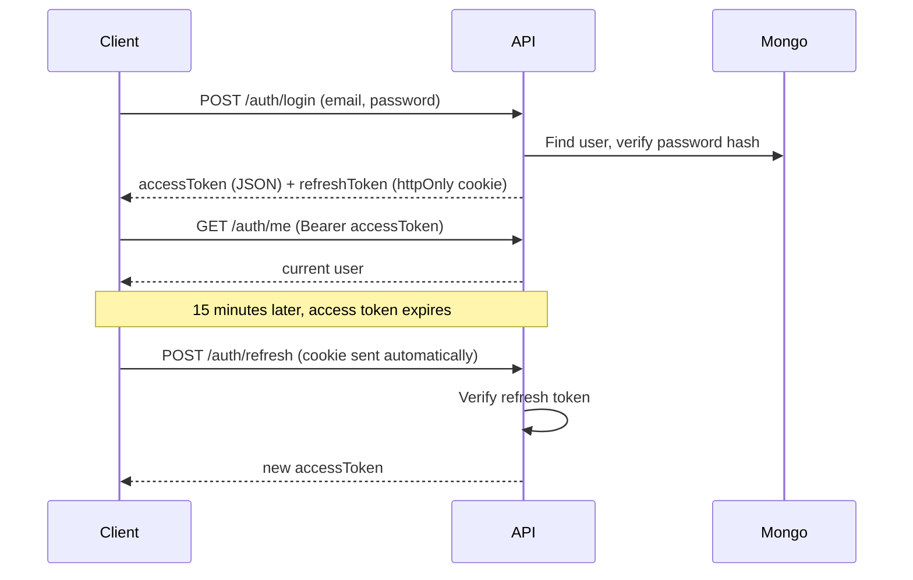

<div align="center">

# ☕ Brewpoint API

### A production-ready REST API powering a coffee marketplace — built with Express, TypeScript & native MongoDB

[](https://nodejs.org/)
[](https://expressjs.com/)
[](https://www.typescriptlang.org/)
[](https://www.mongodb.com/)
[](https://jwt.io/)
[](https://server-brewpoint.onrender.com)

[Live API](https://server-brewpoint.onrender.com/api/health) · [Report Bug](https://github.com/SinghRohan333/server-brewpoint/issues) · [Request Feature](https://github.com/SinghRohan333/server-brewpoint/issues)

</div>

---

## 📖 About

**Brewpoint** is the backend for a multi-vendor coffee marketplace — think beans, brewing equipment, and accessories, sold by multiple sellers, reviewed by real buyers. It's built entirely on the **native MongoDB driver** (no ODM/Mongoose), which means every query — filtering, pagination, aggregation pipelines for stats and joins — is hand-written and fully under your control.

The API handles authentication (including Google Sign-In), a searchable product catalog, a review system with live rating recalculation, and a full admin dashboard with cascading data cleanup.

---

## ✨ Features

**🔐 Authentication & Security**
- Email/password registration & login with `bcryptjs` hashing
- **Google OAuth 2.0** sign-in with automatic account linking for existing emails
- **Dual JWT strategy** — short-lived access tokens (15 min) + long-lived refresh tokens (7 days) stored in `httpOnly` cookies
- Silent token refresh endpoint so users stay logged in without re-entering credentials
- Role-based access control (`user` / `admin`)
- Hardened with `helmet`, a strict CORS policy, and centralized error handling

**🛍️ Product Marketplace**
- Multi-seller product listings across `beans`, `equipment`, and `accessories` categories
- Rich filtering: text search, category, price range, minimum rating, roast level
- Sorting: newest, price (asc/desc), top-rated
- Pagination baked into every list response
- Sellers can manage their own listings (`/products/mine`)

**⭐ Reviews & Ratings**
- One review per user per product (enforced)
- Product rating & review count **automatically recalculated** via aggregation on every new review

**🛠️ Admin Dashboard**
- Platform-wide stats (users, admins, products, reviews)
- User management with role promotion/demotion (self-demotion blocked)
- **Cascading delete** — removing a user cleans up their listings and every review tied to them
- Full product oversight with seller info joined in via aggregation

**📬 Contact**
- Public contact form endpoint with server-side validation

---

## 🧰 Tech Stack

| Layer | Technology |
|---|---|
| Runtime | Node.js |
| Framework | Express 5 |
| Language | TypeScript |
| Database | MongoDB (native driver — no ODM) |
| Auth | JSON Web Tokens (`jsonwebtoken`), `bcryptjs`, Google OAuth (`google-auth-library`) |
| Security | `helmet`, custom CORS middleware, `cookie-parser` |
| Logging | `morgan` |
| Dev tooling | `tsx` (hot reload), `tsc` (build) |
| Deployment | Render |

---

## 🏗️ Project Structure

```
server-brewpoint/
├── src/
│   ├── config/
│   │   └── db.ts               # MongoDB connection singleton
│   ├── controllers/
│   │   ├── authController.ts   # register, login, refresh, Google auth
│   │   ├── productController.ts
│   │   ├── reviewController.ts
│   │   ├── adminController.ts
│   │   └── contactController.ts
│   ├── middleware/
│   │   ├── auth.ts             # protect + requireAdmin guards
│   │   └── errorHandler.ts     # AppError + centralized handler
│   ├── routes/
│   │   ├── authRoutes.ts
│   │   ├── productRoutes.ts
│   │   ├── reviewRoutes.ts      # nested under /products/:id/reviews
│   │   ├── adminRoutes.ts
│   │   └── contactRoutes.ts
│   ├── types/                  # User, Product, Review, ContactMessage interfaces
│   ├── utils/
│   │   ├── jwt.ts               # token sign/verify helpers
│   │   └── getIdParam.ts
│   ├── app.ts                   # Express app + middleware pipeline
│   └── server.ts                # entrypoint — connects DB, starts server
├── tsconfig.json
└── package.json
```

---

## 🔌 API Reference

Base URL (local): `http://localhost:5000/api` · Base URL (live): `https://server-brewpoint.onrender.com/api`

🔒 = requires `Authorization: Bearer <accessToken>` header · 👑 = requires admin role

### Auth — `/auth`
| Method | Endpoint | Description |
|---|---|---|
| `POST` | `/auth/register` | Create a new account |
| `POST` | `/auth/login` | Log in with email & password |
| `POST` | `/auth/google` | Sign in / sign up with a Google ID token |
| `POST` | `/auth/refresh` | Exchange the refresh cookie for a new access token |
| `POST` | `/auth/logout` | Clear the refresh token cookie |
| `GET` | `/auth/me` 🔒 | Get the current logged-in user |

### Products — `/products`
| Method | Endpoint | Description |
|---|---|---|
| `GET` | `/products` | List products — supports `search`, `category`, `minPrice`, `maxPrice`, `rating`, `roastLevel`, `sort`, `page`, `limit` |
| `GET` | `/products/mine` 🔒 | List products created by the logged-in seller |
| `GET` | `/products/:id` | Get a single product by ID |
| `POST` | `/products` 🔒 | Create a new product listing |
| `DELETE` | `/products/:id` 🔒 | Delete a product (owner or admin only) |

### Reviews — `/products/:id/reviews`
| Method | Endpoint | Description |
|---|---|---|
| `GET` | `/products/:id/reviews` | List reviews for a product |
| `POST` | `/products/:id/reviews` 🔒 | Add a review (1–5 rating); recalculates product rating |

### Admin — `/admin`
| Method | Endpoint | Description |
|---|---|---|
| `GET` | `/admin/stats` 👑 | Platform-wide counts (users, admins, products, reviews) |
| `GET` | `/admin/users` 👑 | All users with their listing count |
| `PATCH` | `/admin/users/:id/role` 👑 | Promote/demote a user's role |
| `DELETE` | `/admin/users/:id` 👑 | Delete a user and cascade-delete their products & reviews |
| `GET` | `/admin/products` 👑 | All products with seller name/email joined in |

### Contact — `/contact`
| Method | Endpoint | Description |
|---|---|---|
| `POST` | `/contact` | Submit a contact message |

### Health
| Method | Endpoint | Description |
|---|---|---|
| `GET` | `/api/health` | Simple uptime check |

---

## 🔑 Authentication Flow



---

## 🚀 Getting Started

### Prerequisites
- Node.js 18+
- A MongoDB connection string (local or Atlas)
- (Optional) A Google Cloud OAuth Client ID if you want Google sign-in

### Installation

```bash
git clone https://github.com/SinghRohan333/server-brewpoint.git
cd server-brewpoint
npm install
```

### Environment Variables

Create a `.env` file in the project root:

```env
PORT=5000
NODE_ENV=development

# MongoDB
MONGODB_URI=your_mongodb_connection_string

# JWT secrets — use long, random strings
JWT_ACCESS_SECRET=your_access_token_secret
JWT_REFRESH_SECRET=your_refresh_token_secret

# Google OAuth
GOOGLE_CLIENT_ID=your_google_client_id

# Frontend origin allowed by CORS
CLIENT_URL=http://localhost:3000
```

### Run locally

```bash
npm run dev      # hot-reload dev server (tsx watch)
```

### Build & run for production

```bash
npm run build     # compiles TypeScript to /dist
npm start         # runs the compiled server
```

The API will be available at `http://localhost:5000/api`.

---

## ☁️ Deployment

This API is deployed on **[Render](https://render.com)** and live at:

🔗 **https://server-brewpoint.onrender.com**

> ⚠️ Hosted on Render's free tier — the first request after a period of inactivity may take 30–60 seconds while the instance spins back up.

---

## 🗺️ Roadmap

- [ ] Image upload support (Cloudinary/S3) instead of raw image URLs
- [ ] Order & checkout system
- [ ] Rate limiting on auth routes
- [ ] Swagger/OpenAPI documentation
- [ ] Automated test suite (Jest/Vitest + Supertest)

---

## 👤 Author

**Rohan Singh**

- GitHub: [@SinghRohan333](https://github.com/SinghRohan333)

---

## 📄 License

This project is licensed under the **ISC License**.

<div align="center">

If this project helped you, consider giving it a ⭐!

</div>
